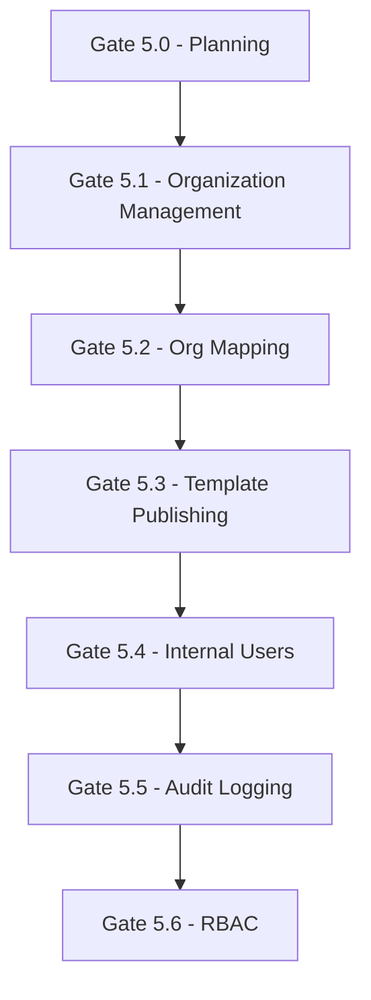

# Gate 5.x — Scope Map

## Document Control

| Attribute      | Value                                   |
| -------------- | --------------------------------------- |
| Module Name    | platform-admin                          |
| Document Title | GATE_5_SCOPE_MAP                        |
| Repo           | Suite (Layer / Product Repo)            |
| Status         | TEMPORARY — PLAN ONLY                   |
| Execution Mode | STRICT · FAIL-CLOSED · GOVERNANCE-FIRST |
| Authority      | Governance Authority (Layer)            |
| Effective Date | 2026-01-30                              |

---

## 1) Purpose

This document maps the scope of each gate in the Gate 5.x series, defining:

- What each gate is responsible for
- What is explicitly out of scope for each gate
- Dependencies between gates
- Verification requirements

---

## 2) Gate 5.1 — Organization Management

### 2.1 Scope

**Responsibility**: Organization operations (create, list, get, suspend, unsuspend)

**Allowed**:

- Organization controller + routes (GET, POST, PATCH)
- Organization service + business logic
- Organization repository + database access
- Prisma schema for `Organization` model
- Database migrations for organization table
- DTO for organization create/update/response
- Unit tests for service + repository
- Integration tests for controller
- Fail-closed invariants tests (no RBAC/auth yet)

**Deliverables**:

- `OrganizationController` with routes:
  - `POST /platform-admin/organizations` (create)
  - `GET /platform-admin/organizations` (list)
  - `GET /platform-admin/organizations/:id` (get one)
  - `PATCH /platform-admin/organizations/:id/suspend` (suspend)
  - `PATCH /platform-admin/organizations/:id/unsuspend` (unsuspend)
- `OrganizationService` with business logic
- `OrganizationRepository` with database access
- Prisma schema + migrations
- Tests (unit + integration + security)

### 2.2 Out of Scope

❌ **Core Integration**: No Core API calls (deferred to Gate 5.2)
❌ **Org Mapping**: No Suite ↔ Core mapping (deferred to Gate 5.2)
❌ **Template Publishing**: No template operations (deferred to Gate 5.3)
❌ **RBAC**: No role-based access control (deferred to Gate 5.6)
❌ **Authorization Logic**: No auth implementation (future gate)
❌ **Audit Logging**: No audit trail (deferred to Gate 5.5)

### 2.3 Verification

- TypeScript compilation passes
- All tests pass (unit + integration + security)
- No Core API calls made
- No org mapping logic present
- Fail-closed enforcement preserved

---

## 3) Gate 5.2 — Org Mapping

### 3.1 Scope

**Responsibility**: Suite ↔ Core organization alignment

**Allowed**:

- Org mapping controller + routes
- Org mapping service + validation logic
- Org mapping repository + database access
- Prisma schema for `OrgMapping` model
- Database migrations for org_mapping table
- **First Core API call**: Validate Core organizationId exists
- Core service token usage (server-only)
- DTO for org mapping create/response
- Unit tests for service + repository
- Integration tests for controller
- Security tests for fail-closed enforcement

**Deliverables**:

- `OrgMappingController` with routes:
  - `POST /platform-admin/org-mappings` (create mapping)
  - `GET /platform-admin/org-mappings` (list mappings)
  - `GET /platform-admin/org-mappings/:id` (get one)
- `OrgMappingService` with validation logic
- `OrgMappingRepository` with database access
- Core API client for org validation
- Prisma schema + migrations
- Tests (unit + integration + security)

### 3.2 Out of Scope

❌ **Template Publishing**: No template operations (deferred to Gate 5.3)
❌ **Internal Users**: No user management (deferred to Gate 5.4)
❌ **RBAC**: No role-based access control (deferred to Gate 5.6)
❌ **Audit Logging**: No audit trail (deferred to Gate 5.5)

### 3.3 Verification

- TypeScript compilation passes
- All tests pass (unit + integration + security)
- Core API calls use server-only token
- No Core token exposed to UI
- Fail-closed enforcement preserved (deny if mapping missing/ambiguous)

---

## 4) Gate 5.3 — Template Publishing

### 4.1 Scope

**Responsibility**: Trigger Core template publish using pre-defined templates

**Allowed**:

- Template publishing controller + routes
- Template publishing service + Core API call
- Core API client for template publish
- DTO for template publish request/response
- Idempotency handling
- Error handling per INTEGRATION_CONTRACT_CORE.md
- Unit tests for service
- Integration tests for controller
- Security tests for authorization

**Deliverables**:

- `TemplatePublishingController` with routes:
  - `POST /platform-admin/templates/publish` (trigger publish)
- `TemplatePublishingService` with Core API call
- Core API client for template publish
- Tests (unit + integration + security)

### 4.2 Out of Scope

❌ **Template Definition**: No template creation UI (templates are pre-defined)
❌ **Workflow Builder**: No visual workflow editor (out of MVP scope)
❌ **Template Execution Tracking**: Core owns execution (Suite only triggers)
❌ **Internal Users**: No user management (deferred to Gate 5.4)
❌ **RBAC**: No role-based access control (deferred to Gate 5.6)
❌ **Audit Logging**: No audit trail (deferred to Gate 5.5)

### 4.3 Verification

- TypeScript compilation passes
- All tests pass (unit + integration + security)
- Core API calls use server-only token
- Idempotency enforced
- Error handling per contract

---

## 5) Gate 5.4 — Internal Users

### 5.1 Scope

**Responsibility**: Platform admin user management

**Allowed**:

- Internal user controller + routes
- Internal user service + CRUD logic
- Internal user repository + database access
- Prisma schema for `InternalUser` model
- Database migrations for internal_user table
- DTO for user create/update/response
- Unit tests for service + repository
- Integration tests for controller
- Security tests for authorization

**Deliverables**:

- `InternalUserController` with routes:
  - `POST /platform-admin/internal-users` (create)
  - `GET /platform-admin/internal-users` (list)
  - `GET /platform-admin/internal-users/:id` (get one)
  - `PATCH /platform-admin/internal-users/:id/deactivate` (deactivate)
- `InternalUserService` with business logic
- `InternalUserRepository` with database access
- Prisma schema + migrations
- Tests (unit + integration + security)

### 5.2 Out of Scope

❌ **Customer Users**: No customer-facing user management (out of MVP scope)
❌ **RBAC**: No role assignment (deferred to Gate 5.6)
❌ **Authentication**: No auth implementation (deferred to future gate)
❌ **MFA**: No multi-factor authentication (out of MVP scope)
❌ **Audit Logging**: No audit trail (deferred to Gate 5.5)

### 5.3 Verification

- TypeScript compilation passes
- All tests pass (unit + integration + security)
- No customer user management present
- No RBAC logic present

---

## 6) Gate 5.5 — Audit Logging

### 6.1 Scope

**Responsibility**: Immutable audit trail for all administrative actions

**Allowed**:

- Audit service + append-only logging
- Audit repository + database access
- Prisma schema for `AuditLog` model
- Database migrations for audit_log table
- Correlation ID propagation
- DTO for audit log response
- Unit tests for service + repository
- Integration tests for audit logging
- Security tests for immutability

**Deliverables**:

- `AuditService` with append-only logging
- `AuditRepository` with database access
- Prisma schema + migrations
- Correlation ID middleware
- Tests (unit + integration + security)

### 6.2 Out of Scope

❌ **Audit Log Modification**: No update/delete operations (append-only)
❌ **Audit Log Deletion**: No deletion allowed (immutable)
❌ **Secrets in Logs**: No secrets, tokens, or PII in audit logs
❌ **RBAC**: No role-based access control (deferred to Gate 5.6)

### 6.3 Verification

- TypeScript compilation passes
- All tests pass (unit + integration + security)
- Audit logs are append-only (no update/delete)
- No secrets in audit logs
- Correlation IDs propagated

---

## 7) Gate 5.6 — RBAC

### 7.1 Scope

**Responsibility**: Role-based access control

**Allowed**:

- RBAC service + role checks
- RBAC guards + decorators
- Role repository + database access
- Prisma schema for `Role` and `UserRole` models
- Database migrations for role tables
- DTO for role assignment
- Unit tests for service + guards
- Integration tests for RBAC enforcement
- Security tests for authorization

**Deliverables**:

- `RBACService` with role checks
- `RBACGuard` with role enforcement
- `@RequireRole()` decorator
- `RoleRepository` with database access
- Prisma schema + migrations
- Tests (unit + integration + security)

### 7.2 Out of Scope

❌ **Custom Permissions**: No custom permission models (use predefined roles)
❌ **External Authorization**: No external auth services (out of MVP scope)
❌ **Fine-Grained Permissions**: No resource-level permissions (role-level only)

### 7.3 Verification

- TypeScript compilation passes
- All tests pass (unit + integration + security)
- Roles enforced: `platform_admin`, `developer_ops`, `support`, `viewer`
- No custom permission models present

---

## 8) Gate Dependencies

**Sequential Execution Required**: Each gate must be completed and tagged before the next gate begins.

---

## 9) Signature

**Status**: TEMPORARY — PLAN ONLY
**Approval**: Pending governance review
**Next Step**: Await explicit approval before Gate 5.1 execution
